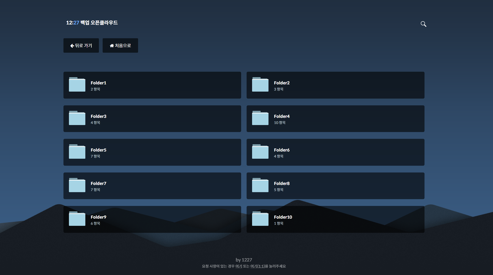

# 1227-opencloud-browser
js+php 기반 웹 컨텐츠 브라우저

## 스크린샷

## 정보
tutorialzine.com의 [Cute File Browser with jQuery and PHP](https://tutorialzine.com/2014/09/cute-file-browser-jquery-ajax-php)와  
Jhamende의 [Cute-File-Browser](https://github.com/Jhamende/Cute-File-Browser)의 코드를 기반으로 만들어진 간단 웹 컨텐츠 브라우저입니다.

## 특징, 변경점
### 팝업 재생
- fancybox를 이용한 팝업 재생*
- 팝업 재생에 음악 파일, 웹페이지 파일도 추가 (.htm)
- 사진 뿐만 아니라 비디오, 오디오, 웹페이지도 갤러리 모드 활성화 (이전/다음 전환)

### 레이아웃 변경
- 화면 확장시 4열이 아닌 2열로 표시되도록 수정
- 문서 타이틀에 현재 디렉토리가 표시되도록 수정
- 디렉토리 이름에 따른 배경이미지 전환 가능 (/assets/js/script.js의 410줄 참고)

### 최적화
- 속도 저하 방지를 위해 이미지 폴더 썸네일 기능 비활성화
- 루트(홈) 경로 이동시 디렉토리를 다시 스캔하지 않도록 변경

*기존 [Cute-File-Browser](https://github.com/Jhamende/Cute-File-Browser)에 반영되었던 사항

## 유의사항
- php 스크립트를 사용할 수 있는 웹 호스팅 환경이어야 합니다.
- 기본적으로 /Home 디렉토리가 브라우저의 루트 디렉토리로 되어 있으므로 심볼릭 링크 또는 디렉토리를 생성해 주셔야 합니다.
- 미디어 스트림을 하시는 경우 서버에 무리가 가지 않도록 전송 속도 제한 설정을 하시는 것을 추천합니다.
